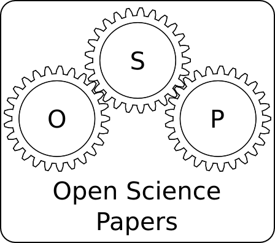

# Open-Science-Paper



This repository contains a LaTeX document with a two column layout which
can be used for collaborative paper writing. The layout is close to
common paper formats which helps to prepare the figures and tables for
publication. The document combines the LaTeX typesetting capabilities with
the power of the statistic programming language R using the Knitr package
(http://yihui.name/knitr/). This combination has the advantage to enable better
reproducibility of your research offering executable documents to others.

## Prerequisites

To get started with this document a working installation of LaTeX and R is
required. Depending on your LaTeX distribution and the type of installation
(full/subset), packages required for the document might have to be installed
additionally. Some LaTeX distributions (e.g MiKTeX, TeX Live) offer package
managers which help you with this task (MiKTeX can install packages
automatically if they are required from a document).

In R you have to install the Knitr package which is documented here:
https://github.com/yihui/knitr. To use the knit command directly from the
console as it is defined in the documents makefile you have to ensure that the
directory of Knitr is in you systems path. For Unix like systems you could add
some code to your ~.bashrc or the configuration of the shell you are using.
For other systems you may find helpful informations about path changes here
http://www.java.com/en/download/help/path.xml.

```
PATH=$PATH:/path/to/your/R_libs/knitr/bin 
```

Or if you don't like to add a path, you could also redefine the makefile to use a
command like the following to knit the .Rnw document.

```
Rscript -e "library(knitr); knit('open_science_paper.Rnw')"
```

On Windows you need to install GNU make (link: fixme) to use the makefile which compiles
the document for you. The make commands are documented below.

## Usage

The usage of this document with GitHub for collaborative writing is easy and
requires only some small steps. Get a GitHub account and turn it into an
organization account under your account settings. You can now fork the document
to get your own copy of the Open-Science-Paper. After that you can checkout your
copy to a local repository and start writing and invite other researchers for
collaboration.

### Makefile

The first variable in the makefile defines the name of the main document to
compile. Right below it you can find the decencies of the main file. If anything
changes in these files the call of make newly compiles the document.

```
# Maindocument
DOCUMENT = open_science_paper

# Dependencies maindocument
DEPENDENCIES = $(DOCUMENT).Rnw subdocuments/open_science_paper.cls subdocuments/*.tex 
```

The programs used for certain tasks are defined in the makefile. You can change
them to your needs by changing the variables. Right at the moment the commands
are adapted for a Unix like system and need to be changed if you like to use the
makefile on a Windows machine. 

```
# Used Programs
KNITR = knit
BIBTEX = biber
PDFLATEX = pdflatex 
PACKER= zip -r
REMOVER = @-rm -r
PRINTER = @-echo 
GREPPER = @-grep
PDFVIEWER = okular
DATE = $(shell date +%y%m%d)
```

The makefile can help you archiving your document. You can adapt the archive
name and the files you wish to add to the archive. The archiver program can be
changed under used programs.

```
# Archive document
ARCHNAME = $(DOCUMENT)-$(DATE)
ARCHFILES = $(DOCUMENT).pdf $(DOCUMENT).Rnw subdocuments data graphics makefile
```

This following variable defines files to clean from the repository if you are
finished. All this files can be cleaned because they are generated while the
compilation process.

```
# Clean up the document folder
CLEANFILES = Bilder/*.tikz cache/* *.xdy *tikzDictionary *.idx *.mtc* *.glo *.maf *.ptc *.tikz *.lot *.dpth *.figlist *.dep *.log *.makefile *.out *.map *.pdf *.tex *.toc *.aux *.tmp *.bbl *.blg *.lof *.acn *.acr *.alg *.glg *.gls *.ilg *.ind *.ist *.slg *.syg *.syi minimal.acn minimal.dvi minimal.ist minimal.syg minimal.synctex.gz *.bcf *.run.xml *-blx.bib  
```

The standard rule which is called when you use make without any options. The
workflow for this task is Knitr > PDF-LaTeX > BibTeX > PDF-LaTeX (call: make).

```
# General rule
all: $(DOCUMENT).pdf 

$(DOCUMENT).pdf: $(DOCUMENT).Rnw subdocuments/open_science_paper.cls subdocuments/*.tex 
	$(KNITR) $(DOCUMENT).Rnw $(DOCUMENT).tex --pdf
	$(PDFLATEX) $(DOCUMENT).tex
	$(BIBTEX) $(DOCUMENT)
	$(PDFLATEX) $(DOCUMENT).tex
```

Special rules you can call to to evoke predefined tasks. You have to call make
with one of the names of rules introduced below (e.g make showpdf). The rule
"showpdf" displays the compiled PDF using the PDF viewer defined under the used
programs (call: make showpdf). 

```
# Special rules
showpdf:
	$(PDFVIEWER) $(DOCUMENT).pdf & 
```

The rule "warnings" displays the warnings from the latest compilation run which
are written into the documents log file (call: make warnings).

```
warnings:
	$(PRINTER) "----------------------------------------------------o"
	$(PRINTER) "Multiple defined lables!"
	$(PRINTER) ""
	$(GREPPER) 'multiply defined' $(DOCUMENT).log
	$(PRINTER) "----------------------------------------------------o"
	$(PRINTER) "Undefined lables!"
	$(PRINTER) ""
	$(GREPPER) 'undefined' $(DOCUMENT).log
	$(PRINTER) "----------------------------------------------------o"
	$(PRINTER) "Warnings!"
	$(PRINTER) ""
	$(GREPPER) 'Warning' $(DOCUMENT).log
	$(PRINTER) "----------------------------------------------------o"
	$(PRINTER) "Over- and Underfull boxes!"
	$(PRINTER) ""
	$(GREPPER) 'Overfull' $(DOCUMENT).log
	$(GREPPER) 'Underfull' $(DOCUMENT).log
	$(PRINTER) "----------------------------------------------------o"
```

The rule "archive" creates a document archive with the name defined in
"ARCHNAME" adding all the files defined under "ARCHFILES".

```
archive:
	$(PACKER) $(ARCHNAME) $(ARCHFILES)
```

The rule "clean" removes the files defined under the variable "CLEANFILES" from
your document folder.

```
clean:
	$(REMOVER) $(CLEANFILES)	
```
